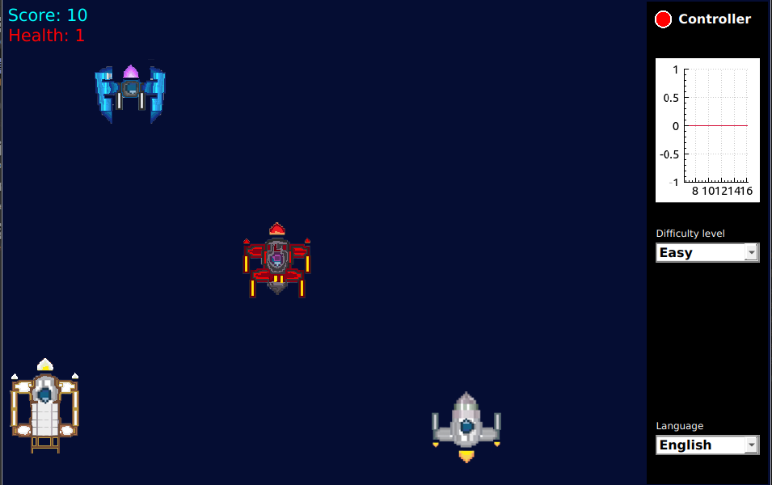
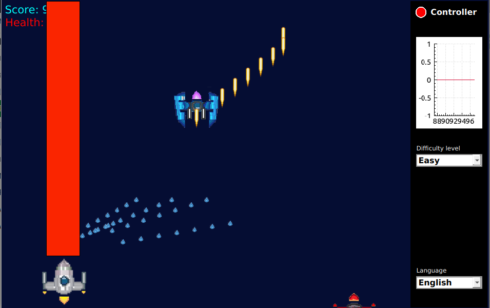
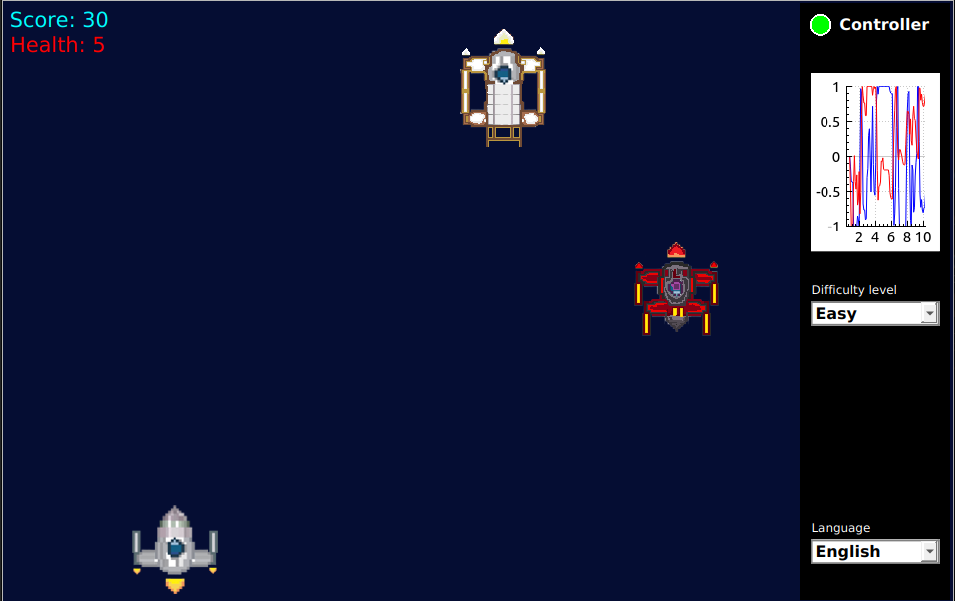

# Space Invaders

A classic arcade-style space shooter built with Qt5, featuring multiple weapon systems, enemy types, and full gamepad support with real-time input visualization.



## Overview

Space Invaders is a desktop game application where players pilot a spacecraft to defend against waves of incoming enemies. The game features a strategic weapon-enemy matching system, where each of the three weapon types is specifically effective against a corresponding enemy type.

The application includes a comprehensive control panel displaying:
- Real-time gamepad connection status
- Live XY-axis visualization of controller input
- Difficulty selection (Easy, Medium, Hard)
- Language settings

## Features

| Feature | Description |
|---------|-------------|
| **Dual Input Support** | Seamless switching between keyboard and gamepad controls |
| **Strategic Combat** | Three distinct weapon types, each effective against specific enemies |
| **Difficulty Modes** | Adjustable difficulty affecting starting health points |
| **Real-time Diagnostics** | Live controller axis plotting using QCustomPlot |
| **Custom Graphics** | Original sprite artwork for ships, enemies, and projectiles |

## Requirements

- **Qt5** with the following modules:
  - Widgets
  - Charts
  - Gamepad
  - LinguistTools
- **CMake** 3.5+
- **C++17** compatible compiler

## Building from Source

```bash
# Clone the repository
git clone https://github.com/Mastej-Git/space-invaders-sdv.git
cd space-invaders-sdv

# Build the project
mkdir build && cd build
cmake ..
make

# Run the game
./SpaceInvaders
```

## Controls

| Action | Keyboard | Gamepad |
|--------|----------|---------|
| Move | Arrow Keys / WASD | Left Stick |
| Fire Weapon 1 | Space | A Button |
| Fire Weapon 2 | E | B Button |
| Fire Weapon 3 | Q | X Button |

## Screenshots

### Weapon Systems
All three projectile types in action:



### Controller Input Visualization
Real-time joystick axis plotting:



## Project Structure

```
space-invaders-sdv/
├── src/           # Source files (.cpp)
├── inc/           # Header files (.h)
├── graphics/      # Game sprites and screenshots
├── docs/          # Doxygen documentation
└── CMakeLists.txt # Build configuration
```

## Documentation

This project includes Doxygen-generated documentation. To build the docs:

```bash
cd docs
doxygen Doxyfile
```

Open `docs/html/index.html` in a browser to view the documentation.

## License

This project was developed as part of a university course Data Visualization on Wroclaw University of Science and Technology.

